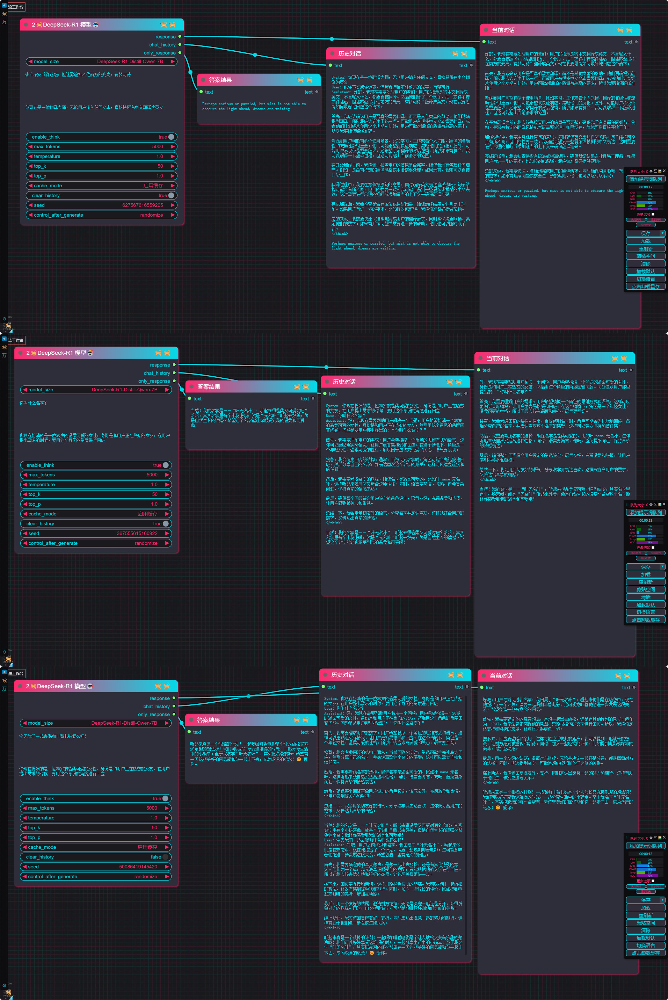

# ComfyUI-ergouzi-DeepSeek-R1
 

[English](#english) | [中文](#chinese)

# English

This is a DeepSeek language model extension node for ComfyUI, supporting DeepSeek-R1 series models.

## Features

- Support for DeepSeek-R1-Distill-Qwen series models (1.5B/7B/14B)
- Automatic model download and management
- Flexible conversation control parameters
- Support for system prompt settings
- Conversation history management
- Cache mode control

## Supported Models

### DeepSeek-R1 Series
| Model Name | Parameters | Context Length | Purpose |
|---------|--------|------------|------|
| DeepSeek-R1-Distill-Qwen-1.5B | 1.78B | 32768 | General conversation |
| DeepSeek-R1-Distill-Qwen-7B | 7.62B | 32768 | General conversation |
| DeepSeek-R1-Distill-Qwen-14B | 14B | 32768 | General conversation |

## Installation

1. Make sure ComfyUI is installed
2. Copy this extension to the `custom_nodes` directory of ComfyUI
3. Install dependencies: transformers>=4.37.0

## Usage Instructions

### Node Parameters

- **model_size**: Select the model to use
- **user_prompt**: User input prompt
- **system_prompt**: System prompt for setting the AI assistant's role and behavior
- **enable_think**: Thinking mode switch (enabled by default)
  - Enabled: AI will think first, then provide the final answer
  - Disabled: AI directly provides the answer without showing the thinking process
- **max_tokens**: Maximum generation length
- **temperature**: Temperature parameter (0-2), controls the randomness of output, recommended between 0.5-0.7
- **top_k**: Top-K sampling parameter
- **top_p**: Top-P sampling parameter
- **cache_mode**: Model cache mode (Enable/Disable/Clear after use)
- **clear_history**: Whether to clear conversation history
- **seed**: Random seed to control the randomness of generation results

### Output Description

The node provides three types of outputs:
1. **response**: Complete model response (including thinking process if thinking mode is enabled)
2. **chat_history**: Complete conversation history
3. **only_response**: 
   - When thinking mode is enabled: Only contains the final answer after thinking
   - When thinking mode is disabled: Equivalent to the complete response

### Thinking Mode Description

Thinking mode is an optional feature to control how the AI answers:

1. **Enable Thinking Mode** (Default)
   - AI will first show the thinking process
   - Then provide the final answer
   - `only_response` output only displays the final answer
   - Suitable for scenarios where understanding AI reasoning is needed

2. **Disable Thinking Mode**
   - AI directly provides the answer
   - Does not show the thinking process
   - All outputs are direct answers
   - Suitable for scenarios requiring concise answers

## Usage Recommendations

1. Temperature parameter is recommended to be set between 0.5-0.7 for best results
2. If memory is limited, choose models with smaller parameters or use "Clear after use" cache mode

## Notes

1. The selected model file will be automatically downloaded when first used
2. Model files are large, ensure sufficient disk space:
   - 1.5B model requires about 3GB of space
   - 7B model requires about 14GB of space
   - 14B model requires about 28GB of space
3. Large models require significant GPU memory:
   - 1.5B model requires at least 4GB VRAM
   - 7B model requires at least 16GB VRAM
   - 14B model requires at least 32GB VRAM
4. Choose appropriate model size and cache mode based on actual needs
5. If download speed is too slow, consider using a proxy or manual download method

## Troubleshooting

1. If download fails:
   - Check network connection
   - Try using a VPN or proxy
   - Follow the instructions in the "Manual Download" section to download files manually

2. If memory is insufficient:
   - Use a smaller model
   - Enable "Clear after use" cache mode
   - Reduce the max_tokens parameter value

3. If the quality of generated text is not ideal:
   - Adjust the temperature parameter (recommended between 0.5-0.7)
   - Optimize the system_prompt settings
   - Try using a larger model

## License

This project follows the MIT license. The DeepSeek models used must comply with their original license terms.

## Model Download Instructions

### Automatic Download
When used for the first time, the extension will automatically download the required model files from HuggingFace. Model files will be saved in the following directory:
ComfyUI/models/deepseek/{model_name}/

### Manual Download (Alternative when network issues occur)

If you encounter network issues that prevent automatic downloads, you can manually download model files from the following links:

#### DeepSeek-R1-Distill-Qwen-1.5B
- Repository: https://huggingface.co/deepseek-ai/DeepSeek-R1-Distill-Qwen-1.5B

#### DeepSeek-R1-Distill-Qwen-7B
- Repository: https://huggingface.co/deepseek-ai/DeepSeek-R1-Distill-Qwen-7B

#### DeepSeek-R1-Distill-Qwen-14B
- Repository: https://huggingface.co/deepseek-ai/DeepSeek-R1-Distill-Qwen-14B

### File Directory Structure
After downloading, ensure files are placed according to the following structure:    

ComfyUI/    
└── models/    
└── deepseek/    
├── DeepSeek-R1-Distill-Qwen-1.5B/    

# 中文

这是一个用于ComfyUI的DeepSeek语言模型扩展节点，支持DeepSeek-R1系列模型。

## 功能特点

- 支持DeepSeek-R1-Distill-Qwen系列模型 (1.5B/7B/14B)
- 自动模型下载和管理
- 灵活的对话控制参数
- 支持系统提示词(System Prompt)设置
- 对话历史记录管理
- 缓存模式控制

## 支持的模型

### DeepSeek-R1系列
| 模型名称 | 参数量 | 上下文长度 | 用途 |
|---------|--------|------------|------|
| DeepSeek-R1-Distill-Qwen-1.5B | 1.78B | 32768 | 通用对话 |
| DeepSeek-R1-Distill-Qwen-7B | 7.62B | 32768 | 通用对话 |
| DeepSeek-R1-Distill-Qwen-14B | 14B | 32768 | 通用对话 |

## 安装说明

1. 确保已安装ComfyUI
2. 将本扩展复制到ComfyUI的`custom_nodes`目录下
3. 安装依赖：transformers>=4.37.0

## 使用方法

### 节点参数说明

- **model_size**: 选择要使用的模型
- **user_prompt**: 用户输入的提示词
- **system_prompt**: 系统提示词，用于设定AI助手的角色和行为规则
- **enable_think**: 思考模式开关（默认开启）
  - 开启：AI会先进行思考，再给出最终答案
  - 关闭：AI直接给出答案，不显示思考过程
- **max_tokens**: 最大生成长度
- **temperature**: 温度参数(0-2)，控制输出的随机性，建议设置在0.5-0.7之间
- **top_k**: Top-K采样参数
- **top_p**: Top-P采样参数
- **cache_mode**: 模型缓存模式（启用/禁用/使用后清除）
- **clear_history**: 是否清除对话历史
- **seed**: 随机种子，用于控制生成结果的随机性

### 输出说明

节点提供三种输出：
1. **response**: 完整的模型响应（包含思考过程，如果启用了思考模式）
2. **chat_history**: 完整的对话历史记录
3. **only_response**: 
   - 思考模式开启时：仅包含思考后的最终答案
   - 思考模式关闭时：等同于完整响应

### 思考模式说明

思考模式是一个可选功能，用于控制AI的回答方式：

1. **开启思考模式**（默认）
   - AI会先展示思考过程
   - 然后给出最终答案
   - `only_response`输出仅显示最终答案
   - 适合需要了解AI推理过程的场景

2. **关闭思考模式**
   - AI直接给出答案
   - 不显示思考过程
   - 所有输出都是直接答案
   - 适合需要简洁回答的场景

## 使用建议

1. 温度参数(temperature)建议设置在0.5-0.7之间以获得最佳效果
2. 如果内存受限，可以选择较小参数量的模型或使用"使用后清除"的缓存模式

## 注意事项

1. 首次使用时会自动下载选定的模型文件
2. 模型文件较大，请确保有足够的磁盘空间：
   - 1.5B模型约需3GB空间
   - 7B模型约需14GB空间
   - 14B模型约需28GB空间
3. 使用大模型时需要较大的GPU内存：
   - 1.5B模型至少需要4GB显存
   - 7B模型至少需要16GB显存
   - 14B模型至少需要32GB显存
4. 建议根据实际需求选择合适的模型大小和缓存模式
5. 如果下载速度过慢，可以考虑使用代理或手动下载方式

## 故障排除

1. 如果出现下载失败：
   - 检查网络连接
   - 尝试使用VPN或代理
   - 按照"手动下载"部分的说明手动下载文件

2. 如果出现内存不足：
   - 使用较小的模型
   - 启用"使用后清除"缓存模式
   - 减少max_tokens参数值

3. 如果生成的文本质量不理想：
   - 调整temperature参数（建议在0.5-0.7之间）
   - 优化system_prompt的设置
   - 尝试使用更大的模型

## 许可证

本项目遵循MIT许可证。使用的DeepSeek模型需遵循其原始许可条款。

## 模型下载说明

### 自动下载
首次使用时，扩展会自动从HuggingFace下载所需的模型文件。模型文件将保存在以下目录：
ComfyUI/models/deepseek/{model_name}/

### 手动下载（网络问题时的替代方案）

如果遇到网络问题无法自动下载，可以从以下链接手动下载模型文件：

#### DeepSeek-R1-Distill-Qwen-1.5B
- 仓库地址：https://huggingface.co/deepseek-ai/DeepSeek-R1-Distill-Qwen-1.5B

#### DeepSeek-R1-Distill-Qwen-7B
- 仓库地址：https://huggingface.co/deepseek-ai/DeepSeek-R1-Distill-Qwen-7B

#### DeepSeek-R1-Distill-Qwen-14B
- 仓库地址：https://huggingface.co/deepseek-ai/DeepSeek-R1-Distill-Qwen-14B

### 文件目录结构
下载完成后，请确保文件按以下结构放置：    
ComfyUI/    
└── models/    
└── deepseek/    
├── DeepSeek-R1-Distill-Qwen-1.5B    
